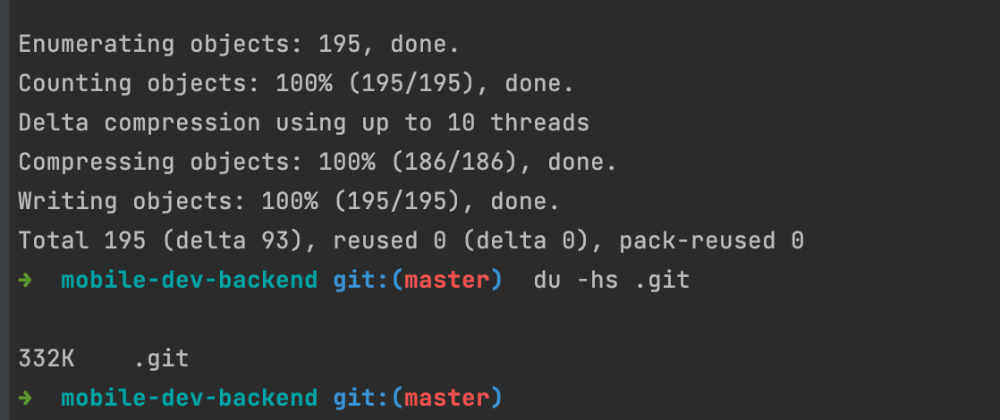

## Task 2
git checkout ci\
git rebase -i HEAD~2\
git checkout master\
git merge ci\
git branch -d ci\

##Task 3

git reflog\
git checkout 8706b90\
git checkout -b old-master\

##Task 4

git blame -L 32,32 prisma/seed.ts\

##Task 5

git bisect start\
git bisect bad\
git bisect good 8673a61216986f4401c85c1b8448488911c2c678\
npm run test\
git bisect bad\
npm run test\
git bisect good\
npm run test\
git bisect bad\
npm run test\
git bisect bad\
git bisect reset\

##Task 6

nano .gitignore\
git add .gitignore\
git commit -m 'add file to gitignore'\
git filter-branch --tree-filter "rm -f .env" -- --all\

##Task 7

git filter-branch -f --env-filter "GIT_AUTHOR_NAME=‘Viktor’\
GIT_AUTHOR_EMAIL=ya-viktor44444@yandex.ru \
GIT_COMMITTER_NAME=‘Viktor’ \
GIT_COMMITTER_EMAIL=ya-viktor44444@yandex.ru»\
HEAD~3..HEAD\

##Task 8

git config --global rerere.enabled true\
git checkout master\
git merge feature\
nano README.md\
git add README.md\
git add .\
git commit\

##Task 9

git fsck\

##Task 10

git gc\
git fsck\
du -hs .git\
git gc --aggressive\
du -hs .git\

##Task 11
git checkout -b report\
nano REPORT.md\
mkdir docs\
git add README.md\

